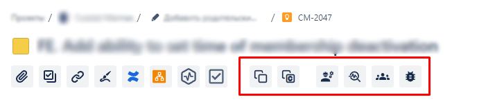
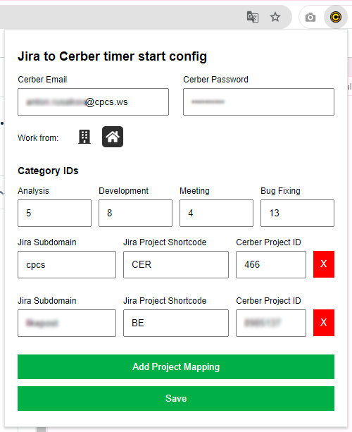

## Jira to Cerber Chrome Extension

This plugin allows you to start timers in Cerber with a single button click. The timer will be started with the ticket number, ticket title, selected task ID corresponding to the ticket, pre-saved workplace, and the selected task type (development/analysis/meeting/bug fixing).

Additionally, two buttons have been added:
- The first button copies the ticket number and title in a format that complies with Git rules + text for the commit message. 
   **DOE-102-Update-S3-Verification-lambda** ` - can be used for Git branches`
   **DOE-102 - Update S3 Verification lambda** ` - can be used in git commit messages`
- The second button simply copies the ticket description and its number for manual timer start in Cerber.
   **#DOE-102 - Update S3 Verification lambda**

Once you click the start work button, it will light up blue, indicating that a request exchange with the Cerber server is in progress. If the button turns green, the timer has been successfully started. If it turns red, an error occurred while exchanging information with Cerber. In case of an error, you can try analyzing it using Chrome dev tools and/or submit the issue on GitHub for detailed analysis by the author.

### Extension Installation:
1. Download the zip archive and extract the project code into any folder.
2. Open the Chrome browser.
3. Navigate to `chrome://extensions/`.
4. Click the "Load unpacked extension" button.
5. Select the folder from step 1.
6. Click the "Select folder" button.
7. The extension icon will appear in the extension tab (located after the address bar).

### Extension Configuration:
1. Click the extension icon.
2. In the popup window, enter your login/password (these credentials are only used for browser-level storage and submission to Cerber. Since Cerber sessions periodically expire, authorization happens before each timer start).
3. Select **Work From**: office/home - this setting, like other settings in this popup, will be saved and won't need to be selected each time you launch the browser.
4. **Category IDs** - you can leave them as is; they are essentially static but are available for modification if necessary.
5. Add relationships of **Jira Subdomain**, **Jira Project Shortcode**, and **Cerber Project ID** for each project you are working on. 
For example, for the Cerber project ticket URL: `https://cpcs.atlassian.net/browse/CER-986`
    - **Jira Subdomain**: "cpcs"
    - **Jira Project Shortcode**: "CER"
    - **Cerber Project ID**: 466 (The project ID in Cerber can be found on the page `https://cerber.cpcs.ws/projects` or by contacting the author if access to this page is restricted).

   Repeat this for all projects you are working on (if needed).
6. Click Save button (!)

After these settings are configured, 6 buttons will appear on the ticket page of the specified projects:
- Clicking the first two buttons will copy the mentioned information to the clipboard.
- The remaining 4 buttons will start the timer. To check it - go to the Cerber page and refresh it, the current open timer should be with the selected ticket's title. 

## FAQ

### 1. **What is the purpose of this plugin?**
The plugin simplifies starting timers in Cerber with just one button click. It automatically includes details such as the ticket number, title, task ID, work location, and task type (e.g., development, analysis, meeting, bug fixing).

### 2. **What happens if I click the start work button?**
Once clicked, the button will turn blue, indicating communication with the Cerber server. If successful, it will turn green, signaling the timer has started. If there's an error, the button will turn red.

### 3. **How do I install the plugin?**
1. Download the zip file and extract it.
2. Open Chrome and go to `chrome://extensions/`.
3. Click "Load unpacked extension."
4. Select the extracted folder and load the extension.

### 4. **What credentials are required to use the plugin?**
You will need to input your Cerber login and password. These credentials are only stored in the browser and used for session management with Cerber.

### 5. **How do I configure the plugin for Jira and Cerber integration?**
In the plugin’s settings, add the Jira Subdomain, Jira Project Shortcode, and Cerber Project ID for each project. This enables the plugin to work across multiple projects.

### 6. **What does each button in the ticket page do?**
- Two buttons copy formatted ticket info for Git commit messages or manual timer start in Cerber.
- The other four buttons start the timer with different task types (development, analysis, meeting, bug fixing).

### 7. **What should I do if the button turns red after starting a timer?**
A red button indicates an error occurred during communication with the Cerber server. You can check the Chrome developer tools for more information or submit the error to GitHub for analysis.

### 8. **How can I check the Cerber Project ID?**
You can find the Cerber Project ID on the project page (`https://cerber.cpcs.ws/projects`) or contact the author if you don't have access to the page.

### 9. **Can I modify the Category IDs?**
Yes, although Category IDs are mostly static, the option to modify them is available in case of changes in Cerber's setup or task categorization.
